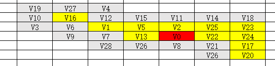
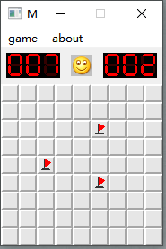

# 文档报告说明_扫雷

[若无法显示图片，可下载文档报告pdf文件](开发文档_扫雷.pdf)

# 1 需求分析

## 1.1 问题阐述

扫雷游戏的游戏界面是由m x n个方格组成的雷区，雷区大小可以由用户设置的游戏难度决定。

雷区中的方块下随机布下若干个地雷。玩家可以通过鼠标来决定方块的状态，地雷所在方块称为雷方块，而其他邻近的非雷方块则会被填充一些数字来表示

邻近的8个方块中有多少雷方块，如“1”表示这个方块相邻的8个方块中一定有一个雷方块。

玩家可以根据这些非雷块数字提示判断是否打开某些方块，并把认为是地雷的方块打上标识。当玩家把所有地雷找出来后，其余非雷方块都已打开，则代表游戏胜利，一旦错误地打开雷方块则立即失败。


## **1.2** 功能需求

（1）设置游戏难度

根据玩家设置，生成大小为m x n， 地雷数量为k的雷区；

 

（2）鼠标响应

1）鼠标左键（挖雷）

在雷区中，当玩家左击未知方块，打开该方块；

a. 如果该未知方块是雷,游戏失败，打开所有地雷；

b. 如果该未知方块是非雷块，则显示该方块周围雷的数目，当该方块周围没有雷（也即雷的数目为0）时，则再继续显示相邻的方块；

 

2）鼠标右键（标记旗子）

当玩家右击未知方块时，标记当前方块为雷方块（插旗），再次右击已标记的雷区则取消当前标记状态；

 

（3）计数器

1）时间计数器，记录这轮游戏所用时间；

2）地雷计数器，记录剩下的地雷数量；

 

（4）随机布雷

随机在雷区中埋入地雷；

 

（5）递归挖雷

当被显示的方块没有地雷（空白区）时，自动显示周围的未知方块，直至显示带有数字的区域。

 

# 2 总体设计

## 2.1 总体功能图

|  |
| :----------------------------------------------------------: |
|                            图2-1                             |

## 2.2 程序总体流程图

|  |
| :----------------------------------------------------------: |
|                            图2-2                             |

 

## 2.3 开发环境

操作系统：Windows10

开发使用语言：C++

开发使用软件：Qt Creator 4.2.0 (4.2.0)

 

## 2.4 主要涉及的数据结构

数组，图的深度优先遍历

 

# 3 核心算法设计

## 3.1 递归挖雷（拓展空白区域）

如图3-1所示，当打开红色标记的方块是空白方块时，程序会自动打开相邻的空白方块和数字方块，结果如图3-2所示。

|  |
| :----------------------------------------------------------: |
|                            图3-1                             |

|  |
| :----------------------------------------------------------: |
|                            图3-2                             |

 

这里主要应用了数据结构中图的深度优先遍历，把扩展的区域抽象成图结构，如图3-3所示，（标红的表示出发点空白方块，标黄表示空白方块，表灰表示数字方块）。

|  |
| :----------------------------------------------------------: |
|                            图3-3                             |

|  |
| :----------------------------------------------------------: |
|                            图3-4                             |

从顶点方块V0出发进行深度优先遍历，在访问V0后，将V0入栈，然后选择未曾访问的邻接方块V5，访问V5之后，将V5入栈，然后选择未曾访问的邻接方块V12，访问V12后，将V12入栈，由于V12是数字方块而非空白方块，所以将V12出栈；取栈顶方块V5的未曾访问的邻接方块V15，访问V15之后，将V15入栈，但是V15是数字方块而非空白方块，所以将V15出栈;取栈顶方块V5的未曾访问的邻接方块V11，以此类推，直到栈空，其中栈的变化如图3-5所示。

|  |
| :----------------------------------------------------------: |
|                            图3-5                             |

3.1.1 算法流程图

|  |
| :----------------------------------------------------------: |
|                            图3-6                             |

 

 

 

3.1.2 伪代码

```
1.访问（打开）顶点方块v；v.blockState=BS_OPEN（修改顶点方块v的状态为打开）;
2.若v.value>0，即v是数字方块
	2.1 处理下一顶点方块;
3.若v.value=0，即v是空白方块
	3.1w=顶点方块v的相邻方块；
    3.2While(w存在（边界检测）)
        3.2.1 if(w未被访问（打开）） 从方块w出发递归执行该算法；
        3.2.2w=顶点方块v的下一个邻接点；
```

3.1.3 时间复杂度

关于数据结构中图的深度优先遍历，由于矩阵元素个数为n²，最坏情况要遍历整个矩阵，因此时间复杂度为O(n²)。

 

3.1.4 具体代码实现

```C++
//in file:Block.cpp
//打开方块
void Block::OpenBlock(int row, int col)
{
    //游戏结束或已经打开、已标记的方块，禁止继续点击方块
    if(gameState==GS_DEAD
            || gameState==GS_WIN
            || map[row][col].blockState==BS_OPEN
            || map[row][col].blockState==BS_MARKED
            || map[row][col].blockState==BS_MARKED_ERROR)
        return;
    //下面均是未打开、未标记方块的情况
    ....
    //打开的是数字方块
    else if(map[row][col].value>0)
    {
        audioClick->play();                        //播放打开数字音效
        map[row][col].blockState=BS_OPEN;           //修改方块为翻开状态
        return;
    }
    //打开的是空白方块，自动翻开周围非雷方块(空白方块周围没有雷)
    else if(map[row][col].value==0)
    {
        audioOpenzero->play();                       //播放打开空白方块音效
        map[row][col].blockState=BS_OPEN;           //修改方块为翻开状态
        for(int rowBlock=row-1;rowBlock<=row+1;rowBlock++)  //遍历相邻的方块
            for(int colBlock=col-1;colBlock<=col+1;colBlock++)
                if(rowBlock>=0                          //越界检测
                        && rowBlock<mRow
                        && colBlock>=0
                        && colBlock<mCol)
                    OpenBlock(rowBlock,colBlock);       //递归挖雷
    }
}
```


## 3.2 随机布雷算法

随机获取一个方块坐标，并判断这个方块是否是雷，若不是则修改它的状态为雷，重复此步骤，直至埋下所有雷。

3.2.1 算法流程图

|  |
| :----------------------------------------------------------: |
|                            图3-7                             |

 

3.2.2 伪代码

```
1. 循环执行下述操作，直到布下所有地雷
	1.1 随机生成坐标(x,y)
	1.2 若坐标为(x,y)的方块不是地雷，则
        1.2.1 修改坐标为(x,y)的方块状态
        1.2.2 已经埋下的地雷数目加一
```


3.2.3 时间复杂度

地雷的数目为n，由于需要布下所有地雷，所以随机布雷算法的时间复杂度为O(n)。

 

3.2.4 具体代码实现

```c++
//in file:Block.cpp   
 //随机布雷
    srand((unsigned)time(NULL));    //设置随机种子
    for(int n=0;n<totalBombNum;)    //直至埋下所有雷
    {
        int rowBlock = rand()%mRow;     //随机行 0~mRow-1
        int colBlock = rand()%mCol;     //随机列 0~mCol-1
        if(map[rowBlock][colBlock].value != -1) //该方块不是地雷
        {
            map[rowBlock][colBlock].value = -1; //修改方块的状态为雷
            n++;                        //成功埋下一颗雷
        }
    }
```

 

## 3.3 获取相邻区域的雷数

如图3-8所示，数字方块的数字为“2”表示这个方块相邻的八个方块中埋有2个地雷。

|  |
| :----------------------------------------------------------: |
|                            图3-8                             |

为了初始化所有数字方块，程序在完成埋雷工作后，遍历整个雷图，计算每个方块的数字，计算的前提是该方块是非雷方块，然后根据相邻的八个方块（在地图范围内）的雷数量进行数目叠加。

 

3.3.1 算法流程图

|  |
| :----------------------------------------------------------: |
|                            图3-9                             |

 

3.3.2 伪代码

```
1.遍历整个雷图，每个遍历到的方块坐标表示v
	1.1if(v不是雷方块)
        1.1.1w=方块v的相邻方块
        1.1.2while(w存在)
                    1.1.2.1if(w不是雷方块)
                        1.1.2.1.1方块v的地雷数加一
```


3.3.3 时间复杂度

由于要遍历整个雷图（二维数组），所以总时间复杂度为O(n^2)；而内两层循环是访问相邻的3~8个方块，循环次数是固定的。

 

3.3.4 具体代码实现

```c++
//in file:Block.cpp    
//计算数字方块的数字
    for(int rowBlock=0;rowBlock<mRow;rowBlock++)//遍历整个雷区
    {
        for(int colBlock=0;colBlock<mCol;colBlock++)
        {
            // 根据相邻的八个方块（在地图范围内）的雷数量进行数目叠加
            // y为行偏移量，x为列偏移量
            // 前提条件是本方块不是雷
            if(map[rowBlock][colBlock].value != -1)
            {
                for(int y=-1;y<=1;y++)       //列
                    for(int x=-1;x<=1;x++)   //行
                        if(colBlock+x>=0                 //越界处理
                                && colBlock+x<mCol
                                && rowBlock+y>=0
                                && rowBlock+y<mRow
                                && !(x==0&&y==0)               //排除自身
                                && map[rowBlock+y][colBlock+x].value == -1)     //非雷块
                            map[rowBlock][colBlock].value++;
            }
        }
    }
```


# 4 UML图

 

|                       全局变量 block.h                       |
| :----------------------------------------------------------: |
| GameState:enum  游戏状态<br/>BlockState:enum 方块状态<br/>BombBlock:struct 方块属性 |

 

|                        Block block.h                         |
| :----------------------------------------------------------: |
| mRow:int 雷图行数<br/>mCol:int 雷图列数<br/>totalBombNum:int 地雷总数<br/>restBombNum:int 剩余地雷数<br/>mTime:int 当局用时<br/>gameState:GameState 当前游戏状态<br/>map:BombBlock ** 雷图指针<br/>    audioClick:QSound * 点击声效指针<br/>    audioBomb:QSound * 雷爆炸声效指针<br/> audioOpenzero:QSound * 打开空白方块声效指针 |
| Create(int row=9,int col=9,int bombNum=10):void 创建指定大小的雷图<br/>OpenBlock(int,int):void 打开方块<br/>MarkBomb(int,int):void 标记方块<br/>CheckGame():void 根据当前游戏状态进行相应处理<br/>Restart():void 重新开始当局游戏 |


|                       Dialog dialog.h                        |
| :----------------------------------------------------------: |
| ROW:int 自定义雷图行数<br/>COL:int 自定义雷图雷数<br/>BOMBNUM:int 自定义雷图地雷总数<br/>isRight:bool 输入合法标志 |
|       getSize():void 获取并检测对话框中用户输入的参数        |

 

| MainWindow mainwindow.h                                      |
| ------------------------------------------------------------ |
| mBlock:Block * 扫雷游戏对象指针mTimer:QTimer * 计时器对象指针 |
| mousePressEvent(QMouseEvent *event):void 鼠标按下事件响应paintEvent(QPaintEvent *event):void 绘图事件响应on_actionRestart_triggered():void 重新开始当局游戏按键响应(菜单栏)信号槽on_actionPrimary_triggered():void 创建初级难度雷图按键响应(菜单栏)信号槽on_actionInternediate_triggered():void 创建中级难度雷图按键响应(菜单栏)信号槽on_actionHigh_triggered():void 创建高级难度雷图按键响应(菜单栏)信号槽on_actionUser_Define_triggered():void 创建自定义雷图按键响应(菜单栏)信号槽on_updateTimer():void 更新计时信号槽on_actionExit_triggered(): 退出程序按键响应(菜单栏)信号槽on_actionHow_to_play_triggered():void 游戏帮助按键响应(菜单栏)信号槽 |

 

|                绘图相关常量参数 mainnwindow.h                |
| :----------------------------------------------------------: |
| BLOCK_WIDTH 格子像素宽<br/>BLOCK_HEIGHT 格子像素高<br/>MENU_HEIGHT 菜单栏像素高<br/>BOARD_HEIGHT 记分板与菜单栏总像素高<br/>ELENUM_WIDTH 计数用数字像素宽<br/>ELENUM_HEIGHT 计数用数字像素高<br/>EXPRESSION_WIDTH 表情像素宽<br/>EXPRESSION_HEIGHT 表情像素高 |
|                                                              |

 

# 5 主体功能实现

## 5.1 创建雷图

5.1.1 程序流程图

|  |
| :----------------------------------------------------------: |
|                            图5-1                             |

 

5.1.2 具体代码实现

```C++
//in file:Block.cpp
//创建雷图
void Block::Create(int row,int col,int bombNum)
{
    //先清空原来的游戏图
    if(map!=NULL) //雷图指针map不为空
    {
        for(int i=0;i<mRow;i++)
        {
            delete map[i];//释放雷图指针map[i]所指向的堆空间
        }
        delete map;//释放雷图指针map所指向的堆空间
        map=NULL;//把雷图指针map设置成空指针
    }
    //设置游戏参数
    mRow=row;
    mCol=col;
    totalBombNum=bombNum;
    restBombNum=bombNum;
    mTime=0;
    gameState = GS_PLAYING;
    //初始化雷图
    map = new BombBlock *[mRow];//开辟一个数量为mRow、存放结构体BlombBlock指针的空间
    for(int rowBlock=0;rowBlock<mRow;rowBlock++)
    {
        map[rowBlock]=new BombBlock[mCol];//开辟一个数量为mCol、存放结构体BlombBlock的空间
        for(int colBlock=0;colBlock<mCol;colBlock++)
        {
            BombBlock bombBlock;                //声明一个方块
            bombBlock.blockState = BS_CLOSE;    //方块默认未打开
            bombBlock.value = 0;                //方块默认是空白方块
            map[rowBlock][colBlock]=bombBlock;  //把方块放入雷图中
        }
    }
    //随机布雷
    srand((unsigned)time(NULL));    //设置随机种子
    for(int n=0;n<totalBombNum;)    //直至埋下所有雷
    {
        int rowBlock = rand()%mRow;     //随机行 0~mRow-1
        int colBlock = rand()%mCol;     //随机列 0~mCol-1
        if(map[rowBlock][colBlock].value != -1) //该方块不是地雷
        {
            map[rowBlock][colBlock].value = -1; //修改方块的状态为雷
            n++;                        //成功埋下一颗雷
        }
    }
    //计算数字方块的数字
    for(int rowBlock=0;rowBlock<mRow;rowBlock++)//遍历整个雷区
    {
        for(int colBlock=0;colBlock<mCol;colBlock++)
        {
            // 根据相邻的八个方块（在地图范围内）的雷数量进行数目叠加
            // y为行偏移量，x为列偏移量
            // 前提条件是本方块不是雷
            if(map[rowBlock][colBlock].value != -1)
            {
                for(int y=-1;y<=1;y++)       //列
                    for(int x=-1;x<=1;x++)   //行
                        if(colBlock+x>=0                 //越界处理
                                && colBlock+x<mCol
                                && rowBlock+y>=0
                                && rowBlock+y<mRow
                                && !(x==0&&y==0)               //排除自身
                                && map[rowBlock+y][colBlock+x].value == -1)     //非雷块
                            map[rowBlock][colBlock].value++;
            }
        }
    }
}
```


## 5.2 鼠标响应

5.2.1 程序流程图

|  |
| :----------------------------------------------------------: |
|                            图5-2                             |

5.2.2 具体代码实现

```C++
//in file:mainwindow.cpp
//鼠标事件
//用户鼠标点击，判断左右键，确定落点，修改块信息，确定是否结束
void MainWindow::mousePressEvent(QMouseEvent *event)
{
    int click_x = event->x();
    int click_y = event->y();
    //先判断是否左键点击了笑脸
    if(event->buttons()==(Qt::LeftButton)
            && click_x>(mBlock->mCol*BLOCK_WIDTH/2-EXPRESSION_WIDTH/2)
            && click_x<(mBlock->mCol*BLOCK_WIDTH/2+EXPRESSION_WIDTH/2)
            && click_y<(7+MENU_HEIGHT+EXPRESSION_HEIGHT)
            && click_y>(7+MENU_HEIGHT))
    {
        mBlock->Restart();//重新开始游戏
        if(mTimer->isActive())
            mTimer->stop();//停止计时
        update();//更新界面
        return;
    }
    //落点在雷图
    else if(click_y<(BLOCK_HEIGHT*mBlock->mRow+BOARD_HEIGHT)
            &&click_y>(BOARD_HEIGHT))
    {
        //游戏结束的情况下，禁止点击方块
        if(mBlock->gameState != GS_WIN && mBlock->gameState != GS_DEAD)
        {
            //开始计时
            if(!(mTimer->isActive()))
                mTimer->start(1000);
            //确定落点(行列)
            int colBlock = click_x/BLOCK_WIDTH;//确定落点所在行
            int rowBlock = (click_y-BOARD_HEIGHT)/BLOCK_HEIGHT;//确定落点所在列
            if(event->button()==(Qt::LeftButton))//若按下的是鼠标左键
                mBlock->OpenBlock(rowBlock,colBlock);//进行打开方块处理

            else if(event->button()==(Qt::RightButton))//若按下的是鼠标右键
                mBlock->MarkBomb(rowBlock,colBlock);//进行标记方块处理
        }
    }
    //落点在菜单栏
    else if(click_y<=MENU_HEIGHT) return;
    mBlock->CheckGame();
    //游戏结束时，停止计时
    if(mBlock->gameState==GS_WIN || mBlock->gameState==GS_DEAD)
    {
        if(mTimer->isActive())
            mTimer->stop();
    }
    update();//更新界面
}
```

```C++
//in file:Block.cpp
//打开方块
void Block::OpenBlock(int row, int col)
{
    //若游戏结束或已经打开、已标记的方块，则禁止继续点击方块
    if(gameState==GS_DEAD
            || gameState==GS_WIN
            || map[row][col].blockState==BS_OPEN
            || map[row][col].blockState==BS_MARKED
            || map[row][col].blockState==BS_MARKED_ERROR)
        return;
    //下面均是未打开、未标记方块的情况
    //打开的是雷方块
    else if(map[row][col].value==-1)
    {
        audioBomb->play();                          //播放雷爆炸音效
        map[row][col].blockState=BS_BOMB_BLAST;     //修改方块为雷爆炸状态
        gameState=GS_DEAD;                          //修改游戏状态为失败
        return;
    }
    //打开的是数字方块
    else if(map[row][col].value>0)
    {
        audioClick->play();                        //播放打开数字音效
        map[row][col].blockState=BS_OPEN;           //修改方块为打开状态
        return;
    }
    //打开的是空白方块，自动打开周围非雷方块(空白方块周围没有雷)
    else if(map[row][col].value==0)
    {
        audioOpenzero->play();                       //播放打开空白方块音效
        map[row][col].blockState=BS_OPEN;           //修改方块为打开状态
        for(int rowBlock=row-1;rowBlock<=row+1;rowBlock++)  //遍历相邻的方块
            for(int colBlock=col-1;colBlock<=col+1;colBlock++)
                if(rowBlock>=0                          //越界检测
                        && rowBlock<mRow
                        && colBlock>=0
                        && colBlock<mCol)
                    OpenBlock(rowBlock,colBlock);       //递归挖雷
    }
}
```

```C++
//in file:Block.cpp
//标记方块
void Block::MarkBomb(int row, int col)
{
    //若游戏结束或已经打开的方块，则禁止继续点击方块
    if(gameState==GS_DEAD
            || gameState==GS_WIN
            || map[row][col].blockState==BS_OPEN)
        return;
    //标记
    if(map[row][col].blockState==BS_CLOSE)  //若当前方块未打开
    {
        if(map[row][col].value != -1)       //若当前方块是雷方块
        {
            map[row][col].blockState=BS_MARKED_ERROR; //修改当前方块的状态为错误标记
            gameState=GS_FAULT;                       //修改当前游戏状态为错误标记
        }
        else                                          //若当前不是雷方块
            map[row][col].blockState=BS_MARKED;       //修改当前方块的状态为已标记
        restBombNum--;                                //当前剩余雷数减一
    }
    //取消标记
    else if(map[row][col].blockState==BS_MARKED       //若当前方块处于已标记或错误标记状态
            || map[row][col].blockState==BS_MARKED_ERROR)
    {
        map[row][col].blockState=BS_CLOSE;             //修改当前方块的状态为未打开
        gameState=GS_PLAYING;                          //修改当前游戏状态为游戏进行中
        restBombNum++;                                 //当前剩余雷数加一
    }
}
```


 

## 5.3 绘制雷图

这里主要调用了Qt的绘图函数，这个函数从用户的位图中截取一部分贴到程序指定的位置中去。

```C++
void drawPixmap(int x, int y, const QPixmap & pixmap, int sx, int sy, int sw, int sh)
/*
x 程序的横坐标
y 程序的纵坐标
pixmap 要截取的位图对象
sx 要截取位图的横坐标
sy 要截取位图的纵坐标
sw 要截取位图的宽度
sh 要截取位图的高度
*/
```


5.3.1 程序流程图

|  |
| :----------------------------------------------------------: |
|                            图5-3                             |

5.3.2 具体代码实现

```C++
//in file:mainwindow.cpp
//绘图事件
void MainWindow::paintEvent(QPaintEvent *event)
{
    QPainter *painter = new QPainter(this);//创建画笔对象
    //加载位图
    QPixmap bmpblocks(":/res/blocks.bmp");//方块
    QPixmap bmpblast(":/res/boomblast.bmp");//雷爆炸
    QPixmap bmpnumber(":/res/number.bmp");//计数用红色数字
    QPixmap bmpfaces(":/res/faces.bmp");//表情
    QPixmap bmpflagerror(":/res/flagerror.bmp");//错误标记

   
    //绘制雷区
    for(int rowBlock=0;rowBlock<mBlock->mRow;rowBlock++)
    {
        for(int colBlock=0;colBlock<mBlock->mCol;colBlock++)
        {
            //根据方块的状态绘制
            switch (mBlock->map[rowBlock][colBlock].blockState) {
            case BS_CLOSE://未打开  10 第十个
                painter->drawPixmap(colBlock*BLOCK_WIDTH,rowBlock*BLOCK_HEIGHT+BOARD_HEIGHT,bmpblocks,BLOCK_WIDTH*10,0,BLOCK_WIDTH,BLOCK_HEIGHT);;
                break;
            case BS_MARKED://标记
                painter->drawPixmap(colBlock*BLOCK_WIDTH,rowBlock*BLOCK_HEIGHT+BOARD_HEIGHT,bmpblocks,BLOCK_WIDTH*11,0,BLOCK_WIDTH,BLOCK_HEIGHT);
                break;
            case BS_OPEN://已打开的数字格子
                painter->drawPixmap(colBlock*BLOCK_WIDTH,rowBlock*BLOCK_HEIGHT+BOARD_HEIGHT,bmpblocks,BLOCK_WIDTH*mBlock->map[rowBlock][colBlock].value,0,BLOCK_WIDTH,BLOCK_HEIGHT);
                break;
            case BS_BOMB_BLAST://中雷
                painter->drawPixmap(colBlock*BLOCK_WIDTH,rowBlock*BLOCK_HEIGHT+BOARD_HEIGHT,bmpblast,0,0,BLOCK_WIDTH,BLOCK_HEIGHT);
                break;
            case BS_MARKED_ERROR://错误标记
                //若是游戏未结束则显示旗子
                if(mBlock->gameState==GS_FAULT||mBlock->gameState==GS_PLAYING)
                    painter->drawPixmap(colBlock*BLOCK_WIDTH,rowBlock*BLOCK_HEIGHT+BOARD_HEIGHT,bmpblocks,BLOCK_WIDTH*11,0,BLOCK_WIDTH,BLOCK_HEIGHT);
                //若是游戏已结束则显示错误标记
                else if(mBlock->gameState==GS_DEAD)
                    painter->drawPixmap(colBlock*BLOCK_WIDTH,rowBlock*BLOCK_HEIGHT+BOARD_HEIGHT,bmpflagerror,0,0,BLOCK_WIDTH,BLOCK_HEIGHT);
                break;
            case BS_BOMB_LIVE://未挖的雷
                painter->drawPixmap(colBlock*BLOCK_WIDTH,rowBlock*BLOCK_HEIGHT+BOARD_HEIGHT,bmpblocks,BLOCK_WIDTH*9,0,BLOCK_WIDTH,BLOCK_HEIGHT);
                break;
            default:
                break;
            }
        }
    }
    //绘制表情
    switch (mBlock->gameState) {
    case GS_PLAYING://12是表情宽度的一半
        painter->drawPixmap(mBlock->mCol * BLOCK_WIDTH / 2 - EXPRESSION_WIDTH / 2, MENU_HEIGHT + 7, bmpfaces, 1 * EXPRESSION_WIDTH, 0, EXPRESSION_WIDTH, EXPRESSION_HEIGHT);
        break;
    case GS_WIN:
        painter->drawPixmap(mBlock->mCol * BLOCK_WIDTH  / 2 - EXPRESSION_WIDTH / 2, MENU_HEIGHT + 7, bmpfaces, 2 * EXPRESSION_WIDTH, 0, EXPRESSION_WIDTH, EXPRESSION_HEIGHT);
        break;
    case GS_DEAD:
        painter->drawPixmap(mBlock->mCol * BLOCK_WIDTH / 2 - EXPRESSION_WIDTH / 2, MENU_HEIGHT + 7, bmpfaces, 0 * EXPRESSION_WIDTH, 0, EXPRESSION_WIDTH, EXPRESSION_HEIGHT); // 24是笑脸的边长,锚点在左上，因为工具栏占了些，所以看起来不在中间
        break;
    default:
        painter->drawPixmap(mBlock->mCol * BLOCK_WIDTH / 2 - EXPRESSION_WIDTH / 2, MENU_HEIGHT + 7, bmpfaces, 1 * EXPRESSION_WIDTH, 0, EXPRESSION_WIDTH, EXPRESSION_HEIGHT);
        break;
    }
    //绘制剩余的雷数
    int rBombNum=mBlock->restBombNum;
    if(rBombNum<0) rBombNum=0;
        painter->drawPixmap(6,5+MENU_HEIGHT,bmpnumber,rBombNum/100*ELENUM_WIDTH,0,ELENUM_WIDTH,ELENUM_HEIGHT);
    if(rBombNum>=100) rBombNum%=100;
        painter->drawPixmap(6+ELENUM_WIDTH,5+MENU_HEIGHT,bmpnumber, rBombNum/10*ELENUM_WIDTH,0,ELENUM_WIDTH,ELENUM_HEIGHT);
        painter->drawPixmap(6+ELENUM_WIDTH*2,5+MENU_HEIGHT,bmpnumber,rBombNum%10*ELENUM_WIDTH,0,ELENUM_WIDTH,ELENUM_HEIGHT);
    //绘制当局游戏用时
    int rTime=mBlock->mTime;
    if(rTime>=1000)rTime%=1000;
        painter->drawPixmap(mBlock->mCol*ELENUM_WIDTH-66,5+MENU_HEIGHT,bmpnumber,rTime/100*ELENUM_WIDTH,0,ELENUM_WIDTH,ELENUM_HEIGHT);
    if(rTime>=100) rTime%=100;
     painter->drawPixmap(mBlock->mCol*ELENUM_WIDTH-6-ELENUM_WIDTH*2,5+MENU_HEIGHT,bmpnumber,rTime/10*ELENUM_WIDTH,0,ELENUM_WIDTH,ELENUM_HEIGHT);
     painter->drawPixmap(mBlock->mCol*ELENUM_WIDTH-6-ELENUM_WIDTH,5+MENU_HEIGHT,bmpnumber,rTime%10*ELENUM_WIDTH,0,ELENUM_WIDTH,ELENUM_HEIGHT);
}
```


## 5.4 游戏输赢判断与处理

 

5.4.1 程序流程图

|  |
| :----------------------------------------------------------: |
|                            图5-4                             |

 

5.4.2 具体代码实现

```C++
//in file:Block.cpp
//检查当前游戏状态
void Block::CheckGame()
{
    switch (gameState) {//判断游戏状态
    case GS_DEAD://游戏失败
        for(int rowBlock=0;rowBlock<mRow;rowBlock++)
        {                                                               //显示所有雷
            for(int colBlock=0;colBlock<mCol;colBlock++)
            {
                if(map[rowBlock][colBlock].value == -1                          //该方块是雷
                        && map[rowBlock][colBlock].blockState != BS_BOMB_BLAST  //非爆炸状态的雷
                        && map[rowBlock][colBlock].blockState != BS_MARKED)     //非正确标记的雷
                    map[rowBlock][colBlock].blockState = BS_BOMB_LIVE;  //修改方块的状态为未标记的雷
            }
        }
        break;
    case GS_FAULT:      //有标记错误，继续游戏
    case GS_WIN:        //游戏胜利
        break;
    default:            //当没有标记错误的情况下，检测所有的雷，若都已经打开或标记，则游戏胜利
        for(int rowBlock=0;rowBlock<mRow;rowBlock++)
            for(int colBlock=0;colBlock<mCol;colBlock++)
            {
                if(map[rowBlock][colBlock].blockState==BS_CLOSE)
                    return;
            }
        gameState=GS_WIN;//改变游戏状态为游戏胜利
        break;
    }    
}
```


 

## 5.5 自定义游戏难度

 

5.5.1 程序流程图

|  |
| :----------------------------------------------------------: |
|                            图5-5                             |

 

5.5.2 具体代码实现

```C++
//in file:mainwindow.cpp
//用户自定义难度
void MainWindow::on_actionUser_Define_triggered()
{
    Dialog *dialog = new Dialog();
    dialog->exec();//显示模态对话框
    //检测输入合法标志是否合法
    if(true==dialog->isRight)
    {
        mBlock->Create(dialog->ROW,dialog->COL,dialog->BOMBNUM);//按输入参数创建雷图
        setFixedSize(mBlock->mCol*BLOCK_WIDTH,mBlock->mRow*BLOCK_HEIGHT+BOARD_HEIGHT);//固定程序窗体尺寸，使之不可拉伸
    }
}
```

```C++
//in file:dialog.cpp
//对话框输入检测
void Dialog::getSize()
{
    QString str;
    str = lineEdit_row->text();//获取行输入框文本
    ROW = str.toInt();//从字符串转换为整数
    str = lineEdit_col->text();//获取列输入框文本
    COL = str.toInt();
    str = lineEdit_bombNum->text();//获取地雷数输入框文本
    BOMBNUM = str.toInt();
    //如果转换失败，int toInt()函数会自动赋值为0，以此来检测输入的是否是正整数
    if(ROW==0||COL==0||BOMBNUM==0)
    {
        //弹窗警告
        QMessageBox msg_checkInt(QMessageBox::Warning, "输入错误","请输入正整数！");
        msg_checkInt.exec();
    }
    //检测输入的行列数是否小于简单难度的设定
    else if(ROW<9 || COL<9)
    {
        //弹窗警告
        QMessageBox message(QMessageBox::NoIcon, "too low", "你还想设置的比初级还要简单？不改高点我就开枪了。");
        message.setIconPixmap(QPixmap("./res/low.png"));
        message.exec();
    }
    //检测地雷数
    else if(BOMBNUM>ROW*COL || BOMBNUM>1000)
    {
        //弹窗警告
        QMessageBox message(QMessageBox::Warning,"输入错误","请输入的雷数不要大于地图总格子数或本游戏上限雷数1000！");
        message.exec();
    }
    //正确输入的情况
    else
    {
        this->close();//关闭对话框窗口
        isRight=true;//修改输入合法标志为合法
        return;
    }
        isRight=false;//修改输入合法标志为非法
}
```


 

 

# 6 程序运行效果图

## 6.1 游戏初始界面

|  |
| :----------------------------------------------------------: |
|                     图 6-1 游戏初始界面                      |

## 6.2 不同难度的雷图

|  |
| :----------------------------------------------------------: |
|                     图 6-2 选择难度菜单                      |

 

|  |
| :----------------------------------------------------------: |
|                       图 6-3 简单难度                        |

|  |
| :----------------------------------------------------------: |
|                       图 6-4 中级难度                        |

 

|  |
| :----------------------------------------------------------: |
|                       图 6-5 高级难度                        |

 

|  |
| :----------------------------------------------------------: |
|                      图 6-6 自定义难度                       |

 

 

## 6.3 打开方块

|  |
| :----------------------------------------------------------: |
|                     图 6-7 打开数字方块                      |

 

|  |
| :----------------------------------------------------------: |
|                     图 6-8 打开空白方块                      |

 

## 6.4 标记方块

 

|  |
| :----------------------------------------------------------: |
|                       图 6-9 标记方块                        |

## 6.5 游戏胜利

 

|  |
| :----------------------------------------------------------: |
|                       图 6-10 游戏胜利                       |

## 6.6 游戏失败

 

 

|  |
| :----------------------------------------------------------: |
|                       图 6-11 游戏失败                       |

## 6.7 游戏规则说明

|  |
| :----------------------------------------------------------: |
|                       图 6-12 规则说明                       |

 

# 7 总结

​	历经半个月，从选题、分析到实现，我一步一步地根据文档的思路构建起程序逻辑，所谓麻雀虽小，五脏俱全，看起来简简单单的扫雷游戏，背后也隐藏着复杂的逻辑，在开发过程中，即使事先画好了程序流程图，大大小小的bug也层出不穷，此时只能耐心地一步步去调试，有时能坐在电脑前一整天，良好的注释习惯能提高开发效率。

​	此次我的选题为扫雷游戏，我运用了数据结构中数组与图的深度优先遍历，进一步深入了解了在线性表的总长度基本稳定，且很少进行插入和删除，但要求以最快的速度存取线性表中的元素时，数组比之链表更具有优越性；还有深度优先遍历运用栈先进先出的特性。好的数据结构决定了程序的运行效率，数据结构+算法=程序。

​	为了增加扫雷游戏的趣味性，我因此去学习了跨平台C++图形用户界面应用程序开发框架Qt，比之以前使用过的MFC，Qt更是封装性好，易上手，学习成本低。

​	程序设计中应贯彻面向对象编程的思维，把问题对象抽象成数据和动作的结合体——类，这是当今软件开发中主流的方法，面向对象编程是模块化的，抽象的，具有易扩展，易维护，可复用的优点。